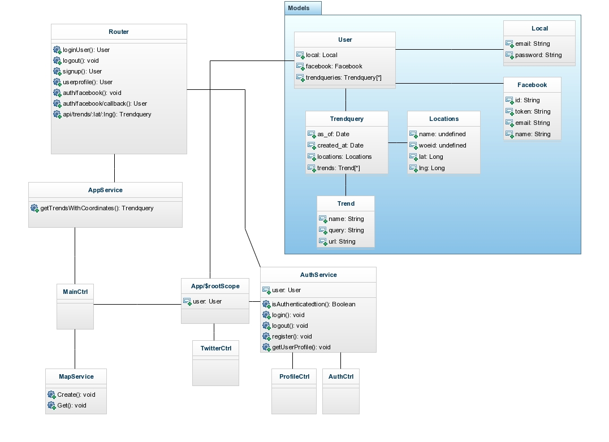

Rapport
----------
<h2>Inledning</h2>

	Användaren kan via en karta klicka och se twitters 10 högsta trender för det aktuella området.
	Vid klick på kartan genomför applikation en request till servern, som i sin tur genomför 2 request till twitters api. Det första för att ta reda på korrelerande WOEID till kordinaterna man har klickat på.  
	Det andra anropet frågar med hjälp av WOEID efter de 10 högst trendande hashtagen som finns i det området som är närmast det hämtade WOEID. 

<h2>Schematisk bild</h2>

<h2>Serversida</h2>

	Applikationen är byggd på MEAN.io "stacken" använder mig således av Node.js och med noSql databasen Mongoose. 
	Router-classen styr applikationens flöde, fungerar som ett api som serverar data beroende på vilken resurs som efterfrågas. 

	Mongoose schemat definerar vilka typer av data som ska hanteras men i övrigt har saknas det validering. Det finns möjlighet att via mongoose lägga till validering/dataannotations på det schemat jag definerat och det borde göras. 

	Felhantering och validering är ganska bristfällig på serversidan, dock hanteras nästan ingen data där, det som sparas är en email och ett tillhörande lösenord. 

<h2>Klientsida</h2>

	Klientsidan är byggd med hjälp av Angular, Angular har ett MVC/MVVM mönster eller "Model-View-Whatever" mönster.

	AuthCtrl ansvarar för att logga in/registrera en användare och visa dess tillhörande vyer, login och signup. Detta med hjälp av AuthService. AppService ansvarar för att skapa kartan med hjälp av MapService och servera map vyn home.  
	TwitterCtrl serverar vyn twitter som visar alla genomförda sökningar. 

	För valideringen på klientsidan använder jag mig av Angular:s egna valideringar.  

<h4>Grunt</h4>

	Grunt används för driftsättning och minifiering av filer. 

<h2>Offline-first</h2>

	Det som saknas för att applikatioen ska vara fullständigt körbar i Offline är att user objectet som hanteras skulle sparas i localstorage, jag har inte kunnat implementera detta buggfritt 
	och därför kan man inte i offline läge refresha sidan, går dock att navigera och visa all data man redan hämtat.

<h4>Cache manifest</h4>

	Använder mig av ett Cache manifest för att deifenra vilka filer som ska chachas. 

<h2>Reflektioner</h2>

	I detta projekt har jag förutom javascript och html uteslutande använt mig av nya tekniker, detta har varit väldigt krävande. 
	Mycket tid har gått åt till att felsöka väldigt "lätta" problem. 

	Strukturen på serversidan är tämligen värdelös i dess nuvarande utformning. Router classen har alldeles för stort ansvar, det enda den egentligen bör göra är att skicka vidare alla request till dess tillhörande kontroller och därefter genomföra det den ska göra.   

	Felhantering och validering är ganska bristfällig på serversidan, dock hanteras nästan ingen data där, det som sparas är en email och ett tillhörande lösenord.   

	Node.js och dess routing är för mig helt nytt och jag har haft väldigt mycket att lära mig dessa veckor, därför har just valideringen hamnat lite i skymundan, jag vet inte riktigt hur man skyddar sig mot sql injects i node. 
	Det finns dock endast 2 fält som bör "saniteras" email och lösenord. Datat jag får från twitter litar jag på. Skulle behöva lägga till validering/dataAnnotations på mina mongoose scheman  

	Om jag dessutom endast skulla ha facebook inlogg skulle den saknade valideringen inte vara något större problem.

<h4>Problem</h4>

	Detta är första gången jag använder dessa tekniker, det har för mig varit mycket problem vid uppstarten av projektet. Det är väldigt mycket som har tagit mer tid än vad jag räknat med, det har också varit svårt att hitta något slags "best-practice" finns oerhört mycket implementationer som bara skiljer sig ytterst lite från varandra. 

<h4>Mer funktionalitet</h4>

	Förutom mer och bättre testning och validering av data på serversidan, skulle jag gärna ha analyserat och presenterat datat från twitter på ett mer utförligt sätt gärna då med hjälp av googles charts. 

	Vidare skulle jag ha velat hantera user objectet med local-storage detta skulle göra att så länge man har loggat in funkar applikationen nästan helt offline. 

<h2>Risker</h2>

	Twitters api har dessutom begränsningar i antalet anrop man har tillåtelse att göra. 15 stycken på lika många minuter.  

<h4>NPM </h4>

	Det finns många beroenden till olika npm installerade ramverk, det känns svårt att ha en bra överblick över allihopa, man vet inte vilka som det fortfarande finns stöd för och som utvecklas vidare. 

<h4>Policy</h4>

	Jag har medvetet valt att inte hantera några tweets, det enda jag sparar är trends dvs taggar/hashtags som man sedan kan söka efter på twitters egna sida. 

<h4> https://dev.twitter.com/overview/terms/policy</h4>
2. i  

	Do not (and do not allow others to) aggregate, cache, or store location data and other geographic information contained in the Content, except as part of a Tweet. Any use of location data or geographic information on a standalone basis is prohibited.

Skriv också om de eventuella delar du anser vara betygshöjande med din applikation. Motivera varför du anser dessa vara betygshöjande.

Facebook kakor, kan leda till buggar

cat /var/log/uppstart/node.log